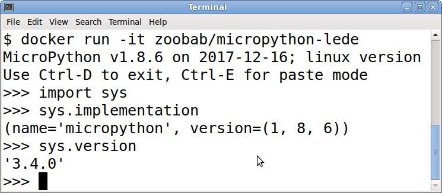

About
=====

A small micropython docker image based on LEDE.

Usage
=====

```
$ docker run -it zoobab/micropython-lede
MicroPython v1.8.6 on 2017-12-16; linux version
Use Ctrl-D to exit, Ctrl-E for paste mode
>>> 
>>> import sys
>>> sys.version_info
(3, 4, 0)
>>> sys.version
'3.4.0'
>>> sys.implementation
(name='micropython', version=(1, 8, 6))
>>> sys.byteorder
'little'
```

Screenshot
==========



Todo
====

* Add upip to be install packages
* Export USB GPIOs from the host machine inside the container
* Export I2C bus from the host machine inside the container
* Add more examples that does not require extra hardware

Links
=====

* Docker hub automated built image: https://hub.docker.com/r/zoobab/micropython-lede/
* Based on the "Minimal LEDE Docker container" by Oskarirauta: https://hub.docker.com/r/oskarirauta/lede-docker/
